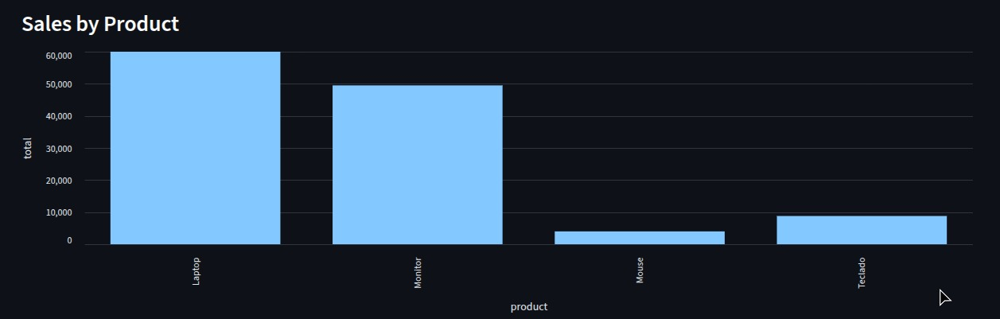
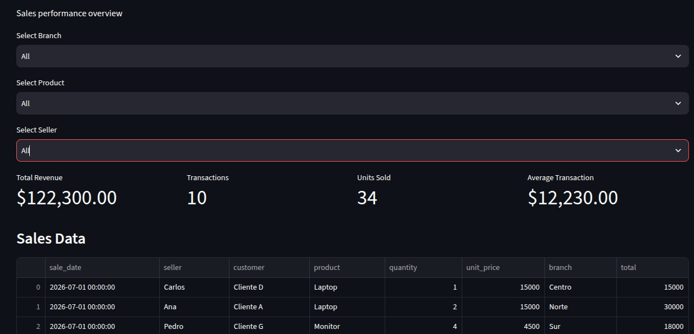
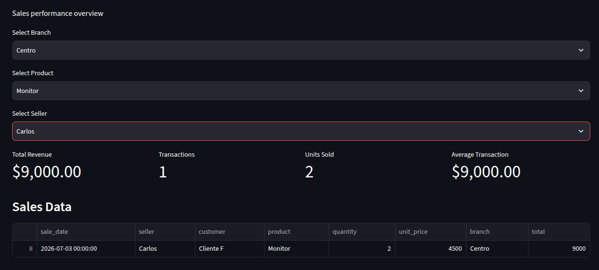
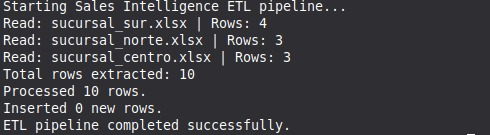

# Sales Intelligence Pipeline — Caso de Estudio

## Automatización integral del proceso de datos de ventas

### 1. El desafío

Una empresa recibía diariamente información de ventas de diferentes sucursales mediante archivos Excel independientes.

Para convertir esos archivos en información útil para la dirección, era necesario realizar manualmente varias tareas:

* Consolidar archivos de diferentes sucursales.
* Limpiar y transformar los datos.
* Calcular importes y métricas.
* Cargar la información en una base de datos.
* Evitar registros duplicados.
* Ejecutar consultas para obtener indicadores.
* Preparar reportes para analizar el desempeño comercial.

Este proceso era repetitivo, consumía tiempo y dificultaba mantener la información actualizada.

### 2. Objetivo

El objetivo fue **automatizar el proceso completo de principio a fin**, desde la recepción de los archivos de ventas hasta la visualización de información para la toma de decisiones.

La solución debía permitir incorporar nuevos datos sin tener que repetir manualmente todo el proceso.

### 3. La solución

Se desarrolló un pipeline de datos que automatiza el flujo:

```text
Archivos Excel
      ↓
Extracción automática
      ↓
Transformación y validación
      ↓
Carga incremental
      ↓
PostgreSQL
      ↓
SQL Analytics
      ↓
Dashboard interactivo
      ↓
Toma de decisiones
```

La solución fue construida utilizando Python, Pandas, PostgreSQL y Streamlit.

### 4. Automatización desarrollada

#### Extracción

El sistema identifica y procesa los archivos Excel de las diferentes sucursales.

Actualmente trabaja con:

* Sucursal Norte
* Sucursal Sur
* Sucursal Centro

#### Transformación

Los datos se convierten a una estructura común y se realizan transformaciones como:

* Normalización de columnas.
* Conversión de fechas.
* Validación de tipos.
* Estandarización de información.
* Cálculo del total de cada venta.

```text
Total = Cantidad × Precio
```

#### Carga incremental

Los datos transformados se almacenan en PostgreSQL.

La solución incorpora una estrategia para evitar duplicados mediante una restricción única basada en los principales atributos de una venta.

Esto permite ejecutar nuevamente el pipeline sin volver a insertar registros existentes.

Por ejemplo:

```text
Processed 10 rows.
Inserted 0 new rows.
ETL pipeline completed successfully.
```

Cuando se incorpora información nueva, el sistema identifica únicamente los registros que deben agregarse.

### 5. Dashboard para toma de decisiones

La información almacenada en PostgreSQL se presenta mediante un dashboard interactivo desarrollado con Streamlit.

El dashboard incluye:

#### KPIs

* Total Revenue
* Transactions
* Units Sold
* Average Transaction

#### Análisis

* Sales by Branch
* Sales by Product
* Sales by Seller
* Sales Trend

#### Filtros interactivos

El usuario puede combinar filtros de:

* Sucursal
* Producto
* Vendedor

Por ejemplo:

```text
Sucursal: Sur
Producto: Monitor
Vendedor: Pedro
```

El sistema devuelve automáticamente:

```text
Total Revenue:        $27,000
Transactions:               2
Units Sold:                  6
Average Transaction:    $13,500
```

El usuario puede realizar este análisis sin modificar código ni ejecutar consultas SQL manualmente.

### 6. Resultados

Con el dataset actual, la solución procesa:

* **3 sucursales**
* **10 transacciones**
* **34 unidades vendidas**
* **$122,300 de ingresos**
* **Carga incremental**
* **Prevención de duplicados**
* **Dashboard interactivo**

El pipeline puede ejecutarse nuevamente cuando llegan nuevos datos y detectar qué registros deben incorporarse.

### 7. Impacto empresarial

La solución transforma un proceso manual de consolidación en un flujo automatizado.

Antes:

```text
Excel
 ↓
Trabajo manual
 ↓
Consolidación
 ↓
Cálculos
 ↓
Reportes
```

Después:

```text
Excel
 ↓
Pipeline automatizado
 ↓
PostgreSQL
 ↓
Dashboard
 ↓
Decisiones
```

Esto permite reducir tareas repetitivas, centralizar la información y facilitar el acceso a indicadores comerciales.

### 8. Valor de la solución

El proyecto demuestra cómo una empresa puede pasar de:

> **“Tengo información dispersa en Excel.”**

a:

> **“Tengo un proceso automatizado que convierte mis datos en información lista para analizar.”**

La arquitectura puede adaptarse posteriormente a otras fuentes de información como CSV, sistemas administrativos, inventarios, CRM o APIs.

### 9. Tecnologías

```text
Python
Pandas
OpenPyXL
SQLAlchemy
PostgreSQL
SQL
Streamlit
Plotly
Git / GitHub
```

### 10. Resultado final

**Sales Intelligence Pipeline** demuestra una solución completa de datos que integra:

**Automatización + ETL + Base de datos + SQL + Business Intelligence + Dashboard**

El objetivo no es solamente almacenar información, sino **automatizar el camino completo desde los datos de origen hasta la información necesaria para tomar decisiones.**
